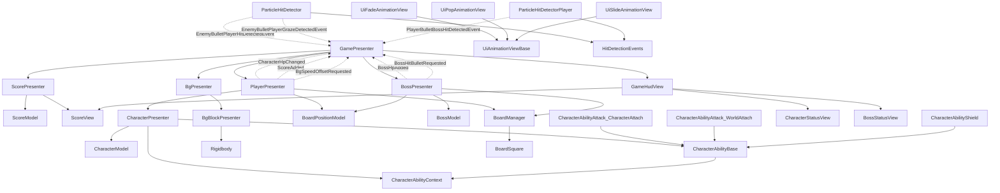

# Game Script Architecture

このドキュメントは、`Assets/Scripts/Game` 配下の主な依存関係を確認するためのメモです。
MVPの考え方そのものは `MVP_README.md` にまとめ、こちらでは実装上のクラス関係を中心に扱います。

## 基本方針

- `Model` は状態や計算を持つ。
- `View` は画面表示、UI部品、演出を扱う。
- `Presenter` は入力、通知、ゲーム進行を受け取り、ModelとViewをつなぐ。
- `View` 同士の親子関係は許可する。
- `Model` から `View` や `Presenter` へ依存しない。
- `PlayerPresenter` や `BossPresenter` はHUDを直接更新せず、通知を発行する。
- `GamePresenter` がゲーム全体の通知を受け取り、`GameHudView` や他Presenterへ橋渡しする。

## 依存方針

```text
Presenter -> Model
Presenter -> View
Presenter -> Presenter
View -> Child View
View -> View Animation
Model -> なし
Detector -> HitDetectionEvents
Ability -> CharacterAbilityContext
```

`CharacterAbilityContext` のようなContextは、処理を持つ上位クラスではなく、必要な参照だけを渡すための値です。
そのため、作る側と受け取る側の両方が同じContext型に依存していても問題ありません。

## 図の凡例

```text
A --> B
```

`A` が `B` を直接参照している、または直接メソッドを呼ぶ関係です。

```text
A -. EventName .-> B
```

`A` が `EventName` という通知を発行し、`B` がそれを購読して受け取る関係です。
通知は、クラスに付属する発信機のようなものとして考えると分かりやすいです。

現在の実装では、この通知はUniRxの `Subject<T>` と `IObservable<T>` で表現しています。
購読側は `Subscribe(...).AddTo(this)` を使い、破棄時の購読解除をUniRxに任せます。

## 全体図



## Presenter

| Class | 主な責任 | 主な依存 |
| --- | --- | --- |
| `GamePresenter` | ゲーム全体の進行、HUD更新通知の集約、背景速度変更、ボスダメージの橋渡し | `GameHudView`, `PlayerPresenter`, `BossPresenter`, `BgPresenter`, `ScorePresenter` |
| `ScorePresenter` | スコアModelの更新とScoreViewへの表示反映 | `ScoreModel`, `ScoreView` |
| `PlayerPresenter` | プレイヤー入力、ボード移動、キャラ切り替え、被弾、パリィ、グレイズ | `BoardManager`, `CharacterPresenter[]`, `BoardPositionModel` |
| `BossPresenter` | ボスのボード移動、被弾通知、受け取った攻撃力からのダメージ計算、HP変更通知 | `BossModel`, `BoardPositionModel`, `BoardManager` |
| `CharacterPresenter` | キャラクター状態、表示用オブジェクト切り替え、アビリティ実行 | `CharacterModel`, `CharacterAbilityBase[]`, `CharacterAbilityContext` |
| `BgPresenter` | 背景ブロック生成、スクロール速度管理、ループ制御 | `BgBlockPresenter[]` |
| `BgBlockPresenter` | 背景ブロック単位のRigidbody移動 | `Rigidbody`, `Transform` |

## Model

| Class | 主な責任 | 使用元 |
| --- | --- | --- |
| `CharacterModel` | HP、最大HP、攻撃力 | `CharacterPresenter` |
| `BossModel` | 防御値、正規化ダメージ計算 | `BossPresenter` |
| `ScoreModel` | スコア保持と加算 | `ScorePresenter` |
| `BoardPositionModel` | ボード上の `x, y` インデックス | `PlayerPresenter`, `BossPresenter` |

## View

| Class | 主な責任 | 主な依存 |
| --- | --- | --- |
| `GameHudView` | HUD全体の親View。子Viewへの参照をまとめる | `CharacterStatusView[]`, `ScoreView`, `BossStatusView` |
| `CharacterStatusView` | キャラクターHPアイコン、顔アイコン表示 | `Image[]`, `Image` |
| `BossStatusView` | ボスHPスライダー、名前表示 | `Slider`, `TextMeshProUGUI` |
| `ScoreView` | 渡されたスコア値をテキスト表示する | `TextMeshProUGUI` |

## UI Animation View

| Class | 主な責任 |
| --- | --- |
| `UiAnimationViewBase` | DOTweenアニメーションの共通処理、UniTask待機、Editor用ショートカット |
| `UiFadeAnimationView` | `CanvasGroup` の透明度を使ったフェード |
| `UiPopAnimationView` | `RectTransform.localScale` を使ったポップ |
| `UiSlideAnimationView` | `RectTransform.anchoredPosition` を使ったスライド |

`PlayHide()` は見た目を非表示にするだけで、`GameObject` は非アクティブにしません。
非表示後に止めたい場合は、呼び出し側で次のようにします。

```csharp
await uiAnimation.PlayHideAsync();
uiAnimation.SetInactive();
```

## Ability

| Class | 主な責任 |
| --- | --- |
| `CharacterAbilityBase` | キャラクターアビリティScriptableObjectの基底クラス |
| `CharacterAbilityContext` | アビリティ実行時に必要なTransform参照だけを渡す値 |
| `CharacterAbilityAttack_CharacterAttach` | キャラクターのアタッチポイントに攻撃Particleを生成 |
| `CharacterAbilityAttack_WorldAttach` | ワールド側のアタッチポイントに攻撃Particleを生成 |
| `CharacterAbilityShield` | キャラクターのアタッチポイントにシールドColliderを生成 |

アビリティは `CharacterPresenter` から実行されます。
ただし、アビリティ側は `CharacterPresenter` 自体には依存せず、`CharacterAbilityContext` 経由で必要なTransformだけを受け取ります。
生成物は寿命が設定されている場合に自動Destroyされます。
寿命が0以下のアビリティでも、`Stop On Character Change` を有効にするとキャラクター切り替え時にDestroyされます。

## Detector

| Class | 主な責任 | 通知先 |
| --- | --- | --- |
| `ParticleHitDetector` | 敵弾Particleとプレイヤー側判定の検知 | `GamePresenter` |
| `ParticleHitDetectorPlayer` | プレイヤー弾Particleとボス側判定の検知 | `GamePresenter` |
| `HitDetectionEvents` | DetectorからGamePresenterへ送るヒット通知の型 | `GamePresenter` |

## Board

| Class | 主な責任 |
| --- | --- |
| `BoardManager` | ボードインデックスから `BoardSquare` を取得 |
| `BoardSquare` | ボードマス単位の座標インデックスとTransform |

## イベント一覧

| 発行元 | イベント | 購読先 | 用途 |
| --- | --- | --- | --- |
| `PlayerPresenter` | `IObservable<CharacterHpChangedEvent> CharacterHpChanged` | `GamePresenter` | キャラクターHP表示更新 |
| `PlayerPresenter` | `IObservable<int> ScoreAdded` | `GamePresenter` | スコア加算 |
| `PlayerPresenter` | `IObservable<float> BgSpeedOffsetRequested` | `GamePresenter` | プレイヤー移動に伴う背景速度の一時変更 |
| `BossPresenter` | `IObservable<Unit> BossHitBulletRequested` | `GamePresenter` | ボス被弾時に、現在プレイヤー攻撃力でダメージを橋渡し |
| `BossPresenter` | `IObservable<float> BossHpAdded` | `GamePresenter` | ボスHP表示加算 |
| `ParticleHitDetector` | `MessageBroker: EnemyBulletPlayerHitDetectedEvent` | `GamePresenter` | 敵弾ヒットをプレイヤーへ反映 |
| `ParticleHitDetector` | `MessageBroker: EnemyBulletPlayerGrazeDetectedEvent` | `GamePresenter` | 敵弾グレイズをプレイヤーへ反映 |
| `ParticleHitDetectorPlayer` | `MessageBroker: PlayerBulletBossHitDetectedEvent` | `GamePresenter` | プレイヤー弾ヒットをボスへ反映 |

## 更新時の目安

- 新しいUI表示を追加したら、`View` と `GameHudView` の関係を追記する。
- 新しいゲーム通知を追加したら、`イベント一覧` に追記する。
- Presenterが直接Viewを複数持ち始めたら、親Viewを作れないか確認する。
- ModelがViewやPresenterを参照し始めたら、依存方針を見直す。
- 依存関係が増えたらMermaid図も更新する。
